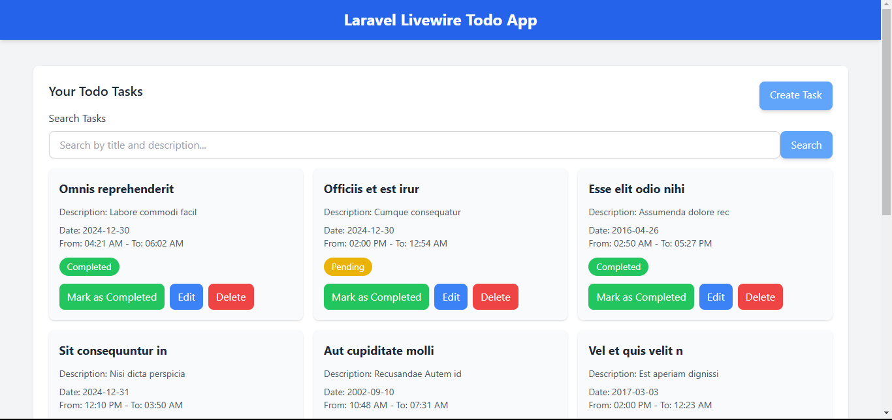
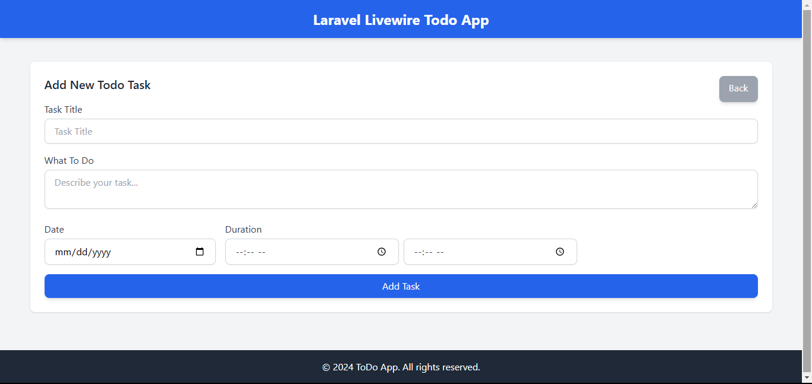

# Todo application using Laravel Livewire
## Engr. Akramul Hoque

### Screen Shorts

<span>


</span>

### Description:

<p>This repository contains a fully functional Todo application built using Laravel Livewire, providing a seamless and interactive user experience without the need for full page reloads. The application enables users to manage their daily tasks with features such as creating, editing, marking as completed, and deleting todos.</p>

### Features:
<p>
* Task Management: Add, edit, delete, and view todos.
* Responsive Design: Optimized for desktop and mobile devices.
* Dynamic Interaction: Real-time task updates powered by Livewire.
* Authorization: Secure access to user-specific todos.
* Validation: Server-side validation for all user inputs.
* Customizable Durations: Set time durations for tasks (from and to fields).
</p>

## Requirements:

```bash
    "php": "^8.2",
    "laravel/framework": "^11.0",
```

# How to run the script?

### step 1: Clone the repository

```bash
    git clone https://github.com/engr-akramulhoque/laravel-livewire-todo.git
```

### step 2: Go to the Directory

```bash
    cd laravel-livewire-todo
```

### step 3: Install all dependencies

```bash
    composer install
    # or
    composer update
```

### step 4: Copy .env files

```bash
    cp .env.example .env
    # it will generate .env file from .env.example
```

### step 5: Configure environment

<p>Open .env file inside any of your code editor and fill all the following credentials</p>

```bash
    # Set .env configuration

    DB_CONNECTION=mysql
    DB_HOST=127.0.0.1
    DB_PORT=3306
    DB_DATABASE=todo_test_db
    DB_USERNAME=root
    DB_PASSWORD=
```

### step 6:

```bash
    php artisan key:generate
    # it will generate the application key
```

### step 6: Dump Database

```bash
    php artisan migrate
    # it will run the database migrations

    php artisan db:seed
    # it will seeding dummy data into the database
```

### step 7:

```bash
    npm install
    # &&
    npm run dev
```

### step 8:

```bash
    php artisan serve
```

<p>Go to Local Server:
    <a href="http://127.0.0.1:8000" target="_blank">http://127.0.0.1:8000</a>
</p>

<p>Login Credentials:
<span>Email: test@example.com</span>
<span>Password: password</span>
</p>

### contributions :

<p>
    Akramul Hoque (Software Engineer)<br>
</p>

<span>copyright: <a href="https://github.com/engr-akramulhoque">Engr. Akramul Hoque</a></span>

### Hope you enjoying this project. Have a good day!

## Thank you!
